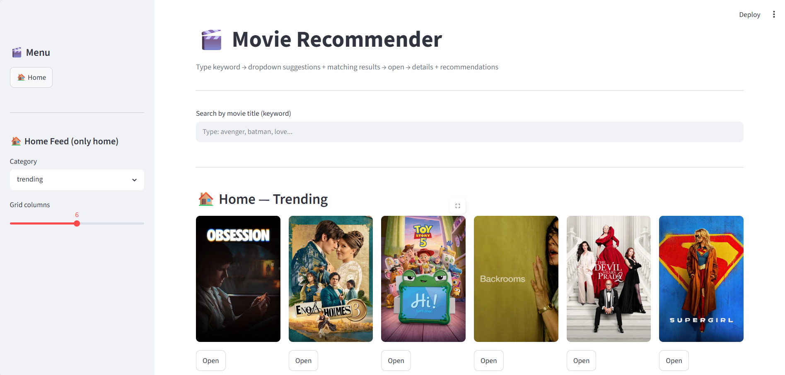
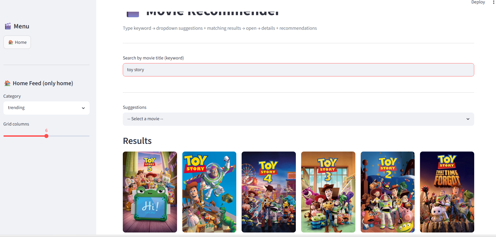
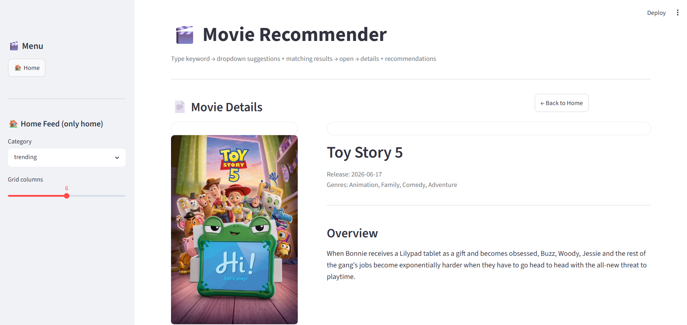
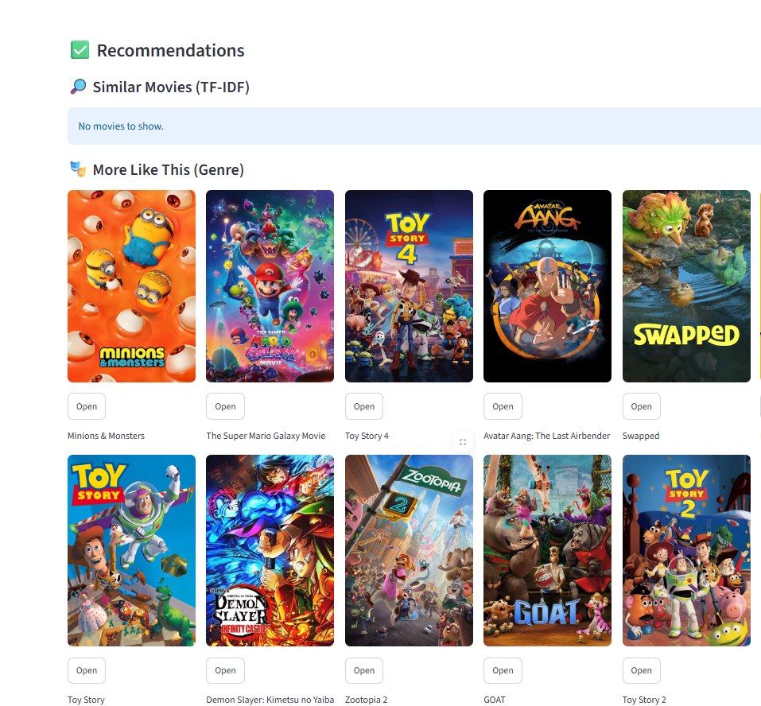

 🎬 Movie Recommendation System

A Content-Based Movie Recommendation System developed using **Python, Streamlit, and Machine Learning**. The application recommends the **Top 10 similar movies** based on the selected movie using **TF-IDF Vectorization** and **Cosine Similarity**. Movie posters are dynamically fetched using the **TMDB API**, providing an interactive and user-friendly experience.

---

## 🚀 Features

- 🎥 Search and select a movie from the dataset.
- ⭐ Get Top 10 similar movie recommendations.
- 🧠 Content-Based Recommendation using Machine Learning.
- 📖 Recommendations based on:
  - Movie Overview
  - Genres
  - Tagline
- 🖼️ Displays movie posters using the TMDB API.
- 💻 Interactive and responsive user interface built with Streamlit.

---

## 🛠️ Technologies Used

- Python
- Streamlit
- Pandas
- Scikit-learn
- TF-IDF Vectorizer
- Cosine Similarity
- TMDB API

---

## 🤖 Machine Learning Approach

This project uses a **Content-Based Filtering** technique to recommend movies.

The recommendation process includes:

1. Data preprocessing and cleaning.
2. Combining movie overview, genres, and tagline into a single text feature.
3. Applying **TF-IDF Vectorization** to convert text into numerical vectors.
4. Calculating similarity using **Cosine Similarity**.
5. Recommending the Top 10 most similar movies.
6. Fetching movie posters using the TMDB API.

---

## 📂 Dataset

This project uses the **TMDB Movies Metadata Dataset**.

---

## ▶️ How to Run

### Clone the Repository

```bash
git clone https://github.com/ritikagadra23/Movie-Recommendation-System.git
```

### Install Dependencies

```bash
pip install -r requirements.txt
```

### Run the Application

```bash
streamlit run app.py
```

---

## 📸 Screenshots

### 🏠 Home Page



---

### 🔍 Search Result



---

### 🎬 Movie Details



---

### ⭐ Top 10 Movie Recommendations



## 📈 Future Improvements

- Add filtering by language and release year.
- Improve recommendation accuracy using hybrid recommendation techniques.
- Add user ratings and watchlist.
- Deploy the application online.

---

## 👩‍💻 Author

**Ritika**

Developed as part of a **45-Day Internship Project** to gain hands-on experience in Machine Learning, Python, and Streamlit.
